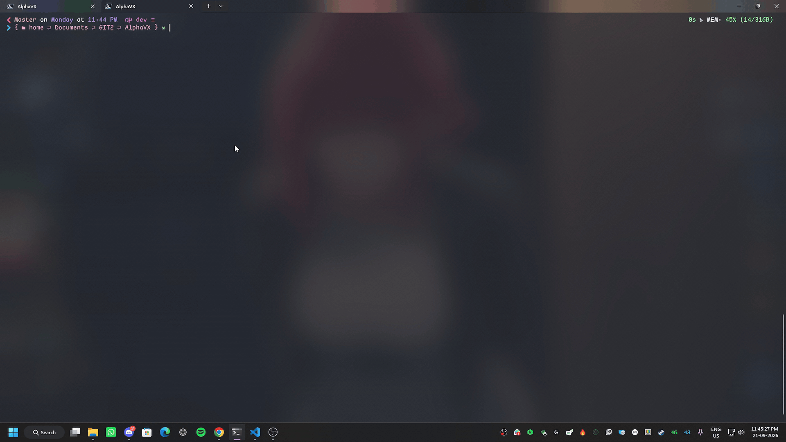

# AlphaVX

<p align="center">
  
</p>

[](https://github.com/RenX86/AlphaVX/actions/workflows/ci.yml)
[](LICENSE)

Batch-score genetic variants against [AlphaGenome](https://deepmind.google.com/science/alphagenome/) and generate interpretable effect reports — gene expression, splicing, chromatin accessibility, histone marks, and transcription factor binding — in one command.

```bash
alphavx score variants.vcf -o results/
```

<p align="center">
  
</p>

---

## What It Does

AlphaGenome (DeepMind, Jan 2026) is a deep learning model that predicts how DNA mutations affect gene regulation across thousands of functional genomic tracks. It analyzes up to 1 million bases of context and matches or exceeds the strongest models in 25 of 26 variant-effect benchmarks.

**AlphaVX** makes it practical to use:

- **VCF batch scoring** — Score all variants from a standard VCF file in one command
- **Resilient execution** — Automatic retry with exponential backoff, result caching, and resumable runs
- **Multi-modal scoring** — Expression (RNA-seq), splicing, chromatin (ATAC/DNase), histone marks (ChIP), TF binding — all scored automatically
- **Interpretable output** — Per-variant report with significance flags, tissue-specific effects, and quantile rankings against common variants
- **Gene panel filtering** — Focus on clinically relevant genes instead of scoring everything

---

## Quick Start

### Install

```bash
pip install alphavx
```

> **Note:** AlphaVX requires an API key from Google DeepMind. [Sign up here](https://deepmind.google.com/science/alphagenome/) if you don't have one.

Once installed, configure your API key securely:

```bash
alphavx configure
```

*(This saves your key globally to `~/.alphavx/.env` so you can run the tool from anywhere).*

---

## Quickstart

If you don't have a VCF file handy, you can generate a small sample dataset instantly:

```bash
alphavx init
```

Now, score the variants:

```bash
alphavx score clinvar_example.vcf -o results/

## CLI Commands

AlphaVX provides several commands for managing configuration, scoring variants, and viewing results.

|    Command    |                                  Description                                  |                Example                |
|---------------|-------------------------------------------------------------------------------|---------------------------------------|
| `configure`   | Interactively save your API key globally.                                     | `alphavx configure`                   |
| `init`        | Generate a sample `clinvar_example.vcf` in the current directory for testing. | `alphavx init `                       |
| `score`       | Batch-score a VCF file, returning interactive reports and annotated VCFs.     | `alphavx score input.vcf -o results/` |
| `query`       | Quickly score a single variant string.                                        | `alphavx query chr17:7674220:G>A`     |
| `report`      | Regenerate the interactive HTML report from existing CSV results.             | `alphavx report results/`             |
| `cache stats` | View the size and hit rate of your local SQLite cache.                        | `alphavx cache stats`                 |
| `cache clear` | Delete all cached responses to force re-scoring.                              | `alphavx cache clear`                 |
| `--help`      | Show the help message and exit.                                               | `alphavx --help`                      |

### Scoring Options
You can further refine the `score` command using options:

```bash
# Filter variants by a specific gene panel before scoring
alphavx score input.vcf --genes BRCA1,TP53,CFTR -o results/

# Use a specific configuration file (for custom thresholds or modalities)
alphavx score input.vcf --config custom_alphavx.yaml -o results/

# Disable the local SQLite cache to fetch fresh scores
alphavx score input.vcf --no-cache -o results/
```

---

## Output

<p align="center">
  
</p>

```
results/
├── scores.csv            # Full scoring table (all variants × all modalities)
├── significant.csv       # Variants exceeding significance thresholds
├── report.html           # Interactive summary report
├── cache/                # Cached API responses (resumable)
└── plots/
    ├── summary_heatmap.png
    └── per_variant/
        ├── chr17_7674220_G_A.png
        └── ...
```

### scores.csv columns

|      Column      | Description                                             |
|------------------|---------------------------------------------------------|
| `chrom`          | Chromosome                                              |
| `pos`            | Position (1-based)                                      |
| `ref` / `alt`    | Reference and alternate alleles                         |
| `gene`           | Nearest gene                                            |
| `modality`       | Scored output type (RNA_SEQ, SPLICE_SITES, DNASE, etc.) |
| `tissue`         | Biosample / tissue name                                 |
| `raw_score`      | AlphaGenome raw effect score                            |
| `quantile_score` | Percentile rank vs common variants (±0.999990 max)      |
| `significant`    | Boolean flag (quantile > 0.995)                         |

---

## How It Works

```
                                                    VCF file
                                                       ↓
                                     Parse variants (chrom, pos, ref, alt)
                                                       ↓
                                   Check cache → skip already-scored variants
                                                       ↓
                                              For each variant:
                                                            → Build 1MB interval around variant
                                                            → Score against all recommended variant scorers
                                                            → Tidy scores, match gene strand
                                                       ↓
                                     Aggregate results → flag significant hits
                                                       ↓
                                       Generate report (CSV + HTML + plots)
```

---

## Configuration

Copy `alphavx.yaml` and customize:

```yaml
api:
  key_env: ALPHAVX_API_KEY
  max_retries: 3
  retry_delay: 5.0

scoring:
  modalities:
    - RNA_SEQ
    - SPLICE_SITES
    - SPLICE_SITE_USAGE
    - SPLICE_JUNCTIONS
    - DNASE
    - ATAC
    - CHIP_HISTONE
    - CHIP_TF
  quantile_threshold: 0.995
  sequence_length: 1048576

output:
  format: [csv, html]
  plots: true
  cache: true
```

---

## Requirements

- Python ≥ 3.10
- AlphaGenome API key ([sign up](https://deepmind.google.com/science/alphagenome/))
- Internet connection (API-based, no local GPU needed)

---

## Tech Stack

| Component | Choice |
| ----------- | -------- |
| AlphaGenome SDK | `alphagenome>=0.6.1` |
| CLI | Typer + Rich |
| Caching | SQLite (zero-dependency, resumable) |
| Reports | Self-contained HTML |
| Plots | Matplotlib + Seaborn |
| Packaging | pyproject.toml + Hatch |

---

## Development

```bash
git clone https://github.com/RenX86/AlphaVX
cd AlphaVX
pip install -e ".[dev]"
pytest
```

---

## License

[Apache 2.0](LICENSE)

---
